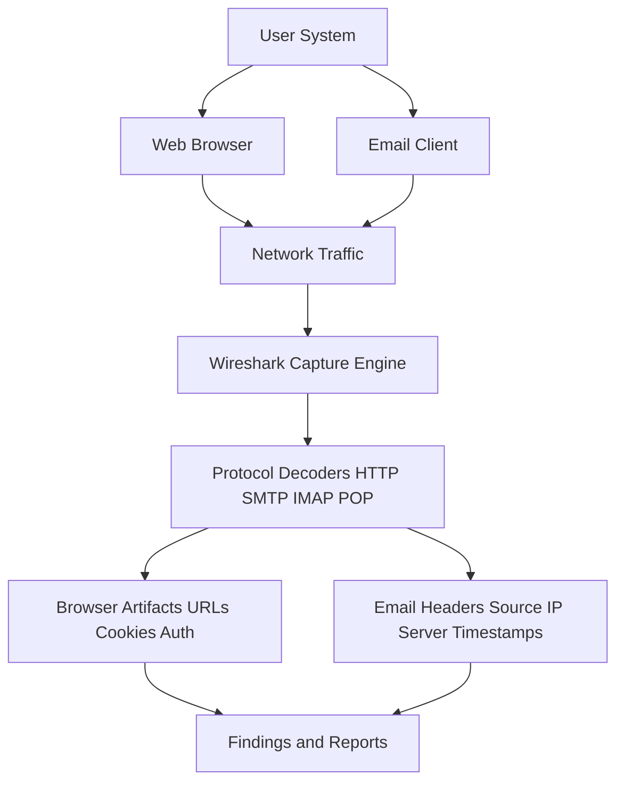
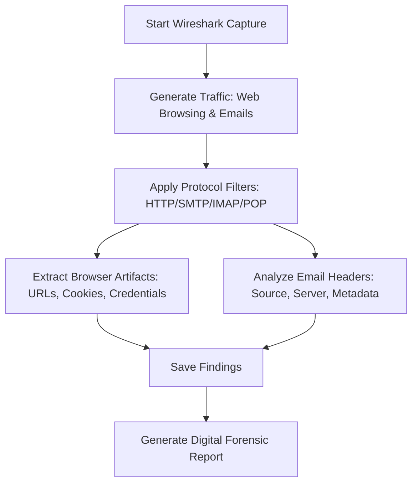

# Using-Wireshark---analyzing-web-browser-artifacts-email-header-analysis
## AIM:
To use Wireshark to analyze web browser activities and inspect email headers from captured network traffic.
## Architecture Diagram:

```mermaid
flowchart TD
    A[User System] --> B[Web Browser]
    A --> C[Email Client]
    B --> D[Network Traffic]
    C --> D
    D --> E[Wireshark Capture Engine]
    E --> F[Protocol Decoders HTTP SMTP IMAP POP]
    F --> G[Browser Artifacts URLs Cookies Auth]
    F --> H[Email Headers Source IP Server Timestamps]
    G --> I[Findings and Reports]
    H --> I
```
## DESIGN STEPS:
### Step 1:
- Install Wireshark and ensure correct network adapter selection.
- Enable packet capturing for your active interface (Wi-Fi/Ethernet).

### Step 2:
**Web Browser Artifact Analysis**
- Open a browser and visit websites with login forms (use dummy credentials).
- In Wireshark, filter traffic with:
    - ```http``` for normal HTTP requests
    - ```http.cookie``` for cookies
    - ```http.authbasic``` for basic authentication
- Identify:
    - URLs visited
    - GET/POST requests
    - Cookies & session IDs
    - Credentials (if plaintext HTTP is used)
### Step 3:
- Capture email traffic by sending/receiving emails (dummy mail server or provided PCAP).
- Use filters:
    - ```smtp``` (Simple Mail Transfer Protocol)
    - ```pop``` / ```imap``` (for received mail)
- Inspect email headers:
    - Source IP
    - Mail server hostname
    - Timestamps
    - Possible forged headers
## PROGRAM:

```mermaid
flowchart TD
    A[Start Wireshark Capture] --> B[Generate Traffic: Web Browsing & Emails]
    B --> C[Apply Protocol Filters: HTTP/SMTP/IMAP/POP]
    C --> D[Extract Browser Artifacts: URLs, Cookies, Credentials]
    C --> E[Analyze Email Headers: Source, Server, Metadata]
    D --> F[Save Findings]
    E --> F[Save Findings]
    F --> G[Generate Digital Forensic Report]
```

## OUTPUT:
Captured Web Activity and Email Header Information


## RESULT:
Web browser artifacts and email headers were successfully analyzed using Wireshark.

